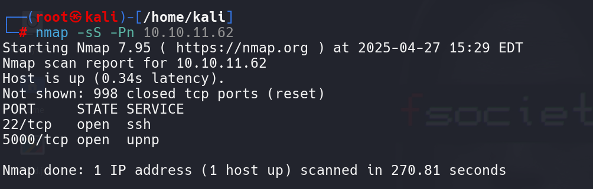
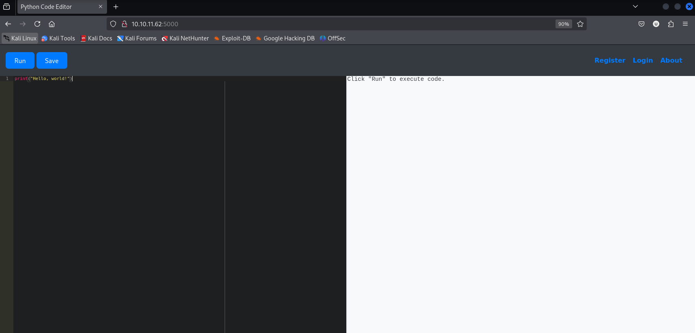
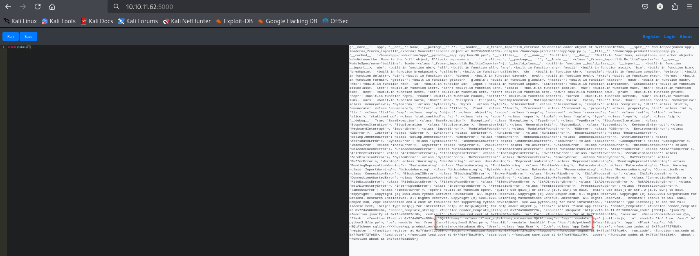
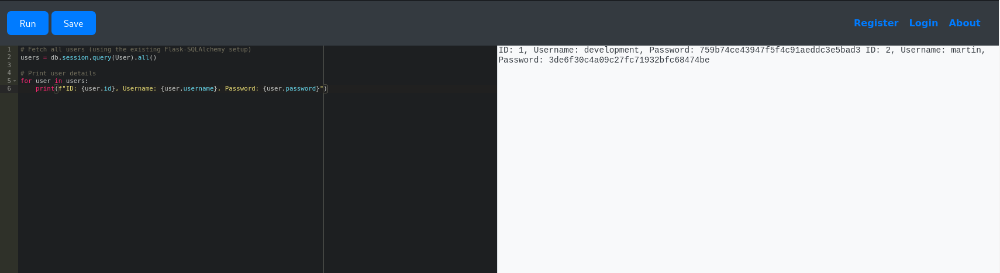
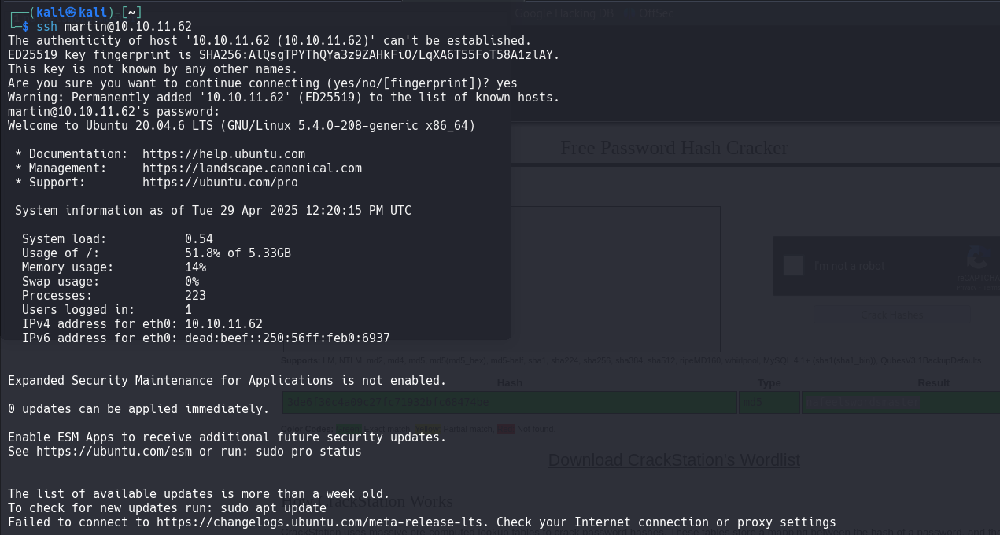

First nmap scan on IP given

Found two ports open ssh and upnp 

On port 5000 Python Code Editor is running 

After trying many commands most of the commands are restricted but then successfully printed the global variables and globals that has sensitive data.

Finally revealed some information 

Flask Application (app = <Flask 'app'>)
Confirms this is a Python Flask web app .

Database:
SQLAlchemy with SQLite (sqlite:////home/app-production/app/instance/database.db).

After this look for users and password in the database
By quering database found username and password of two users

Successfully logged in as martin 

